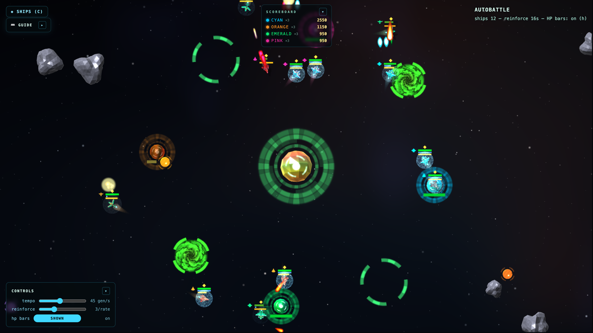

<div align="center">

# Ganymede

**A deterministic WebGPU space autobattler.**
Four AI fleets flock, fight, and raid each other's bases around a central
gravity well — or take the stick and fly one ship through escalating waves.

[](https://alanrsoares.github.io/ganymede/)
&nbsp;
[](https://github.com/alanrsoares/ganymede/actions/workflows/deploy.yml)
[](https://bun.com)
[](https://caniuse.com/webgpu)



</div>

> Needs a WebGPU browser: Chrome/Edge 113+, or Safari 18+.

## Modes

- **Autobattle** — up to 4 AI teams flock and fight to the last base. Tune tempo
  and reinforcement rate live; click a ship to take control, or set a rally point.
- **Arcade** — pilot a single ship, survive escalating enemy waves, chase a high
  score. Pick a hull and a difficulty (Easy / Normal / Hard / Endless); the stage
  sets spawn pressure and lives.

## Controls

| Input | Action |
|-------|--------|
| Click a ship | Take manual control |
| `W` `A` `S` `D` / arrows | Steer the controlled ship |
| `Space` | Boost |
| `1`–`7` | Weapon / ability actions |
| Right-click / Shift-click | Set a team rally point (autobattle) |
| Click empty space | Deselect, or drop a ship |
| `Z` / `X` | Launch reinforcements |
| `H` | Toggle HP bars |
| `C` | Codex (pauses the game) |

## Ship classes

Four hulls, each on its own stat and weapon path:

| Class | Role | Weapon |
|-------|------|--------|
| **Scout** | Fastest, fragile; shares base-raid progress with allies | `vulcan` |
| **Fighter** | Balanced gunner; extra barrel at max level | `vulcan` |
| **Heavy** | Tank; drops mines and seeking missiles at rank | `proton` |
| **Interceptor** | Nimble | `plasma` |

Combat runs on a counter-web — each class beats the next:

```
scout → interceptor → heavy → fighter → scout
```

A ship that counters its target rams harder and presses in; a countered ship
chips lightly and holds off.

## Develop

Requires [Bun](https://bun.com) (≥ 1.3).

```bash
bun install
bun run web        # dev server with HMR at http://localhost:3000
bun test           # sim characterization tests
bun run check      # biome lint + tsc typecheck
bun run hero       # recapture docs/hero.png from a live Autobattle (needs the dev server)
```

## Build & deploy

```bash
bun run build      # bundle (HTML + Tailwind + assets) → dist/
bun run deploy     # build, then force-push dist/ to the gh-pages branch
```

Pushing to `main` also auto-builds and deploys via
[`deploy.yml`](.github/workflows/deploy.yml) (GitHub Pages). `bun run deploy` is
the manual fallback.

## Architecture

The simulation is a pure, seeded, Elm-style state machine — `update(msg, world)`
returns a new immutable `World`; no `Date.now()` or `Math.random()` inside it, so
runs are fully deterministic and testable.

| Path | Responsibility |
|------|----------------|
| `src/world/` | The sim: `update`, per-system tick phases (`tick/*`), steering, tuning, factory |
| `src/overlay/` | Pure view — turns a `World` into GPU instance buffers |
| `src/gpu.ts` | WebGPU renderer (raw WebGPU + `typegpu/data` for buffer layouts) |
| `src/runtime/` | Imperative edges — DOM input and the fixed-timestep loop |

UI chrome is [VanJS](https://vanjs.org); styling is Tailwind v4.
