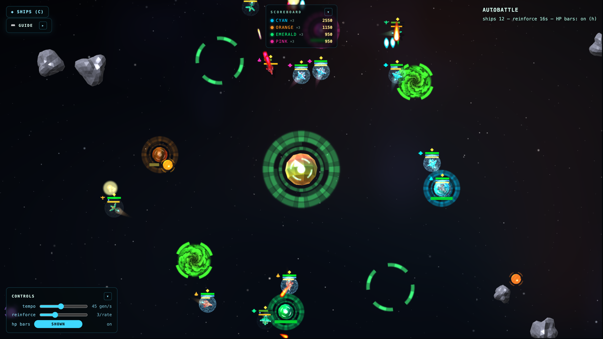
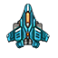
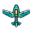
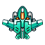
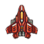

<div align="center">

# Ganymede!

**A deterministic WebGPU space autobattler.**
Four AI fleets fight around a central gravity well, raiding each other's bases.
Or pilot one ship through escalating enemy waves.

[](https://alanrsoares.github.io/ganymede/)
&nbsp;
[](https://github.com/alanrsoares/ganymede/actions/workflows/deploy.yml)
[](https://bun.com)
[](https://caniuse.com/webgpu)



</div>

> Needs a WebGPU browser: Chrome/Edge 113+, or Safari 18+.

## Modes

- **Autobattle**: 2–4 AI teams fight until one team remains. Adjust tempo and
  reinforcements, take control of a ship, or set a rally point.
- **Arcade**: pilot one ship through escalating enemy waves and set a high score.
  Pick a hull and difficulty (Easy / Normal / Hard / Endless); each tier sets
  enemy pressure and lives. Your five best runs per difficulty persist in the
  browser and show in the arcade lobby.

## Controls

| Input | Action |
|-------|--------|
| Click a ship | Take manual control |
| `W` `A` `S` `D` / arrows | Steer the controlled ship |
| `Space` | Boost |
| `1`–`7` | Weapon / ability actions |
| Right-click / Shift-click | Set a team rally point (autobattle) |
| Click empty space | Release control, or drop a ship |
| `Z` / `X` | Launch reinforcements |
| `H` | Toggle HP bars |
| `M` | Mute / unmute audio |
| `.` | Skip to the next soundtrack variation |
| `C` | Codex (pauses the game) |

## Ship classes

Four hulls, each on its own stat and weapon path:

| Hull | Class | Role | Weapon |
|:---:|-------|------|--------|
|  | **Scout** | Fastest and most fragile; shares base-raid progress with nearby allies | `vulcan` |
|  | **Fighter** | Balanced gunner; extra barrel at max level | `vulcan` |
|  | **Heavy** | Armored; lays mines and refuels allies | `proton` |
|  | **Interceptor** | Nimble; fires seeking missiles | `plasma` |

Classes counter one another in a four-way cycle:

<p align="center">
   →
   →
   →
   →
  
</p>

A ship deals more damage and closes distance against the class it counters. A
countered ship deals less damage and keeps its distance.

## Audio

Audio follows the deterministic sim. Combat events such as muzzle flashes,
explosions, and EMP blasts become sounds without a separate gameplay state.
Larger hits use pre-rendered OGG samples; frequent effects such as gunfire and
impacts are synthesized to avoid exhausting audio voices. Menu, battle, and
arcade tracks crossfade with the game state and loop without a gap. The corner
**mixer** (🎚️) controls master, music, and SFX levels, plus mute; settings persist.

- **SFX** are procedural. Regenerate them with `bun run scripts/gen-audio.ts`
  (needs `ffmpeg`).
- **Music** tracks are instrumental synthwave rendered offline with
  [ACE-Step](https://github.com/ace-step/ACE-Step), then trimmed to
  `src/assets/audio/music/*.ogg`. `scripts/gen-music.ts` is a dependency-free
  procedural fallback.

## Develop

Requires [Bun](https://bun.com) (≥ 1.3).

```bash
bun install
bun run dev        # dev server with HMR at http://localhost:3000
bun test           # sim characterization tests
bun run check      # biome lint + tsc typecheck
bun run hero       # recapture docs/hero.png from a live Autobattle (needs the dev server)
```

## Build & deploy

```bash
bun run build      # bundle (HTML + Tailwind + assets) → dist/
bun run deploy     # build, then force-push dist/ to the gh-pages branch
```

Pushing to `main` also auto-builds and deploys via
[`deploy.yml`](.github/workflows/deploy.yml) (GitHub Pages). `bun run deploy` is
the manual fallback.

## Architecture

The simulation is a pure, seeded, Elm-style state machine. `update(msg, world)`
returns a new immutable `World`; it never calls `Date.now()` or `Math.random()`,
so runs are fully deterministic and testable.

| Path | Responsibility |
|------|----------------|
| `src/world/` | The sim: `update`, per-system tick phases (`tick/*`), steering, tuning, factory |
| `src/render/overlay/` | Pure view that turns a `World` into GPU instance buffers |
| `src/render/gpu.ts` | WebGPU renderer (raw WebGPU + `typegpu/data` for buffer layouts) |
| `src/runtime/` | Imperative edges: DOM input and the fixed-timestep loop |

UI chrome is React, styled with Tailwind v4 and Astryx.
