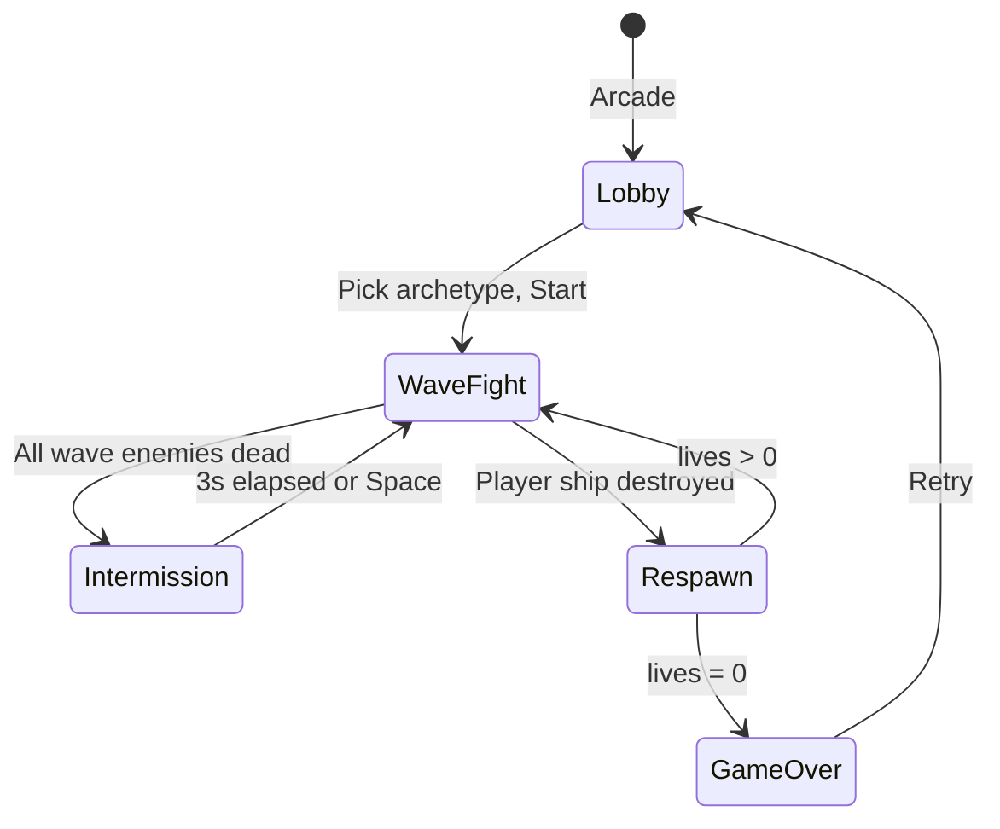

# Arcade Mode — Design & Execution Plan

Goal: add a **Pilot-first arcade mode** — fly one ship, survive escalating
waves, chase a high score — as a distinct entry path alongside the existing
autobattle presets. Same pure sim core (`update(Msg, World)`); different
`MatchConfig`, defeat/victory rules, wave scheduler, and UI shell. Architect
for **Commander (B)** and **Hybrid (C)** roles later without rewriting v1.

## Current state

- **Modes today** are implicit via `MatchConfig.format`: `"standard"` (last team
  wins after sudden death) or `"endless"` (no winner). Setup presets in
  `setup.ts`: Duel, Standard, Chaos, Sandbox.
- **Flow:** `welcome.ts` → `setup.ts` → `main.ts` `startMatch` → play → win
  banner → setup reopens.
- **Player control exists** but is optional: click a ship → `controlledShipId`,
  WASD steer, Space fire (`world/tick/motion.ts`, `interactions.ts`).
- **Scoring** is tracked per team (`SCORE_KILL`, `SCORE_MERGE`, `SCORE_PICKUP`
  in `tuning.ts`) but **not used for victory**.
- **Reinforcement** via `replenish` → `reinforceUnderdog` (`update.ts`) —
  balances teams during the reinforce window; irrelevant to arcade waves.
- **Progression** is the full raid→center-pad loop (L1–5). See
  `docs/leveling-paths-plan.md`.
- **No high-score persistence** — no `localStorage` usage yet.

## Design decisions (locked)

| # | Topic | Choice |
|---|--------|--------|
| 1 | Player role | **Pilot** first; extensible → Commander, Hybrid |
| 2 | Defeat | **3 lives**; respawn at cyan base |
| 3 | Win | **Score attack** — no formal win; run ends at 0 lives |
| 4 | Pressure | **Discrete waves** + intermissions |
| 5 | Death penalty | **Soft** — `level = max(1, level − 1)`, full HP/shield at base |
| 6 | UI entry | **Welcome fork** → streamlined **arcade lobby** (archetype picker) |
| 7 | Enemy bases | **Destructible** during wave; **full HP reset** between waves |
| 8 | Player base | **Indestructible** — HP floors at 1 |
| 9 | Progression | **Full raid → center pad** loop (unchanged) |
| 10 | Persistence | **localStorage top 10** + run stats (score, waves, kills, time) |
| 11 | Enemy factions | **2 fronts** — orange + emerald; pink inactive |
| 12 | Intermission | **Hybrid** — 3s minimum, skip with Space |

## Vision

**Autobattle** = watch/tune the sim. **Arcade** = fly one ship, survive waves,
chase a high score. Arcade is a *mode*, not a different game.

## Gameplay loop

```
Lobby (pick archetype)
  → Wave N spawns (enemies split across orange/emerald bases)
  → Fight: pilot cyan ship, raid bases, level up at center pad, score kills
  → Player dies → −1 life, −1 level, respawn at base (if lives > 0)
  → All wave enemies dead → WAVE CLEARED → intermission
      → enemy bases heal to full; 3s breather (Space to skip early)
  → Next wave (escalating count + enemy level cap)
  → 0 lives → GAME OVER → score + stats + high-score table → Retry / Lobby
```



### Feedback layers (gameplay-mechanics)

| Layer | Arcade implementation |
|-------|----------------------|
| Immediate (0–100ms) | Death explosion, muzzle flash, WAVE CLEARED banner |
| Short-term (100ms–1s) | HP bar, life-lost pip, intermission countdown |
| Long-term (1s+) | Score climb, level-up at center pad, high-score table |

## Extensible config schema

Extend `MatchConfig` in `world/types.ts` without breaking autobattle:

```ts
type PlayerRole = "pilot" | "commander" | "hybrid";

type VictoryRule =
  | { kind: "none" }                       // arcade score attack (v1)
  | { kind: "lastTeam" }                   // autobattle standard
  | { kind: "scoreTarget"; points: number }; // future Commander

type DefeatRule =
  | { kind: "lives"; count: number }       // arcade pilot (v1)
  | { kind: "baseDestroyed" };              // future Commander

type WaveConfig = {
  intermissionMinGens: number;             // ~3s × tempo
  spawn: (wave: number) => { count: number; maxLevel: number };
};

interface ArcadeConfig {
  readonly playerRole: PlayerRole;
  readonly playerTeam: string;             // "cyan"
  readonly playerArchetype: Archetype;
  readonly victory: VictoryRule;
  readonly defeat: DefeatRule;
  readonly waves: WaveConfig;
  readonly enemyTeams: readonly string[];  // ["orange", "emerald"]
}

// MatchConfig gains:
format: "standard" | "endless" | "arcade";
arcade?: ArcadeConfig;  // present when format === "arcade"
```

**B/C later:** swap `playerRole`, `victory`, `defeat` — same wave scheduler
and UI shell.

## World state additions

Add to `World` (arcade-only; ignored in autobattle):

```ts
readonly arcade: {
  lives: number;
  wave: number;
  waveRemaining: number;       // enemies left to kill this wave
  phase: "fight" | "intermission";
  intermissionGens: number;
  runStats: { kills: number; startTime: number };
} | null;
```

`winner` stays `null` in arcade. Game over = `arcade.lives === 0` and player
ship is gone.

## Sim changes (by file)

### `world/types.ts`

- Extend `MatchConfig` + `World` as above.
- New msgs: `{ kind: "arcadeSkipIntermission" }`; player death detected in tick
  or via explicit msg.

### `world/init.ts`

- `initArcadeWorld(seed, config, archetype)`:
  - `teams: 3` (cyan + orange + emerald).
  - Spawn **one** player ship at cyan base with chosen archetype.
  - Set `controlledShipId` immediately (auto-pilot on start).
  - `arcade: { lives: 3, wave: 1, phase: "fight", ... }`.
  - Pink base inactive (excluded from `activeTeams` or HP 0).

### `world/tick/arcade.ts` (new)

Arcade phase machine (call from tick pipeline before/inside `finalize.ts`):

| Concern | Behavior |
|---------|----------|
| Wave spawn | On wave start / intermission end → `waves.spawn(wave)` enemies across enemy bases |
| Wave clear | `waveRemaining === 0` → `phase: "intermission"`, banner event |
| Intermission | Tick counter; heal enemy bases to full; skip on msg or after min gens |
| Base HP floor | If `format === "arcade"` && team === playerTeam → clamp base HP ≥ 1 |
| Enemy base wipe | Allow HP → 0 during fight; reset on intermission |
| Player death | Ship with `controlledShipId` dies → lives−1, respawn logic |
| Autobattle replenish | **Disabled** in arcade (`reinforceUnderdog` no-op) |

### `world/tick/finalize.ts`

- `decideWinner` — skip when `format === "arcade"`.
- Score still accumulates — player score = `world.score.cyan`.

### `world/update.ts`

- Handle `arcadeSkipIntermission`.
- Player respawn: spawn ship at cyan base, `level = max(1, prevLevel - 1)`,
  reassign `controlledShipId`.

### `world/tuning.ts`

Default wave curve (tune in playtest):

```ts
spawn: (wave) => ({
  count: 3 + wave,
  maxLevel: Math.min(5, 1 + Math.floor(wave / 2)),
})
// Wave 1: 3 enemies L1 → wave N: (3+N) enemies, level cap rises every 2 waves
```

## UI changes (by file)

### `welcome.ts`

- Two CTAs: **Arcade** | **Autobattle**.
- `begun` resolves with `{ mode: "arcade" | "autobattle" }`.

### `arcade-lobby.ts` (new)

- Archetype picker (scout / fighter / heavy / interceptor).
- High-score table (read from `localStorage`).
- **Start** → `buildArcadeConfig(archetype)` → `onStart(config)`.

### `setup.ts`

- Unchanged for autobattle path.

### `ui.ts`

- Arcade HUD: lives (3 pips), wave N, phase banner, score (cyan).
- Game-over panel: score, waves, kills, time, high scores, Retry / Lobby.

### `main.ts`

- Branch post-welcome: arcade lobby vs setup.
- `startArcadeMatch(cfg)` — skip staggered deploy; spawn player + wave 1.
- `handleMatchEnd` — arcade path → game-over screen (not team win banner).
- Wire Space during intermission → `arcadeSkipIntermission`.

### `scores.ts` (new)

- `loadHighScores()` / `saveRun(stats)` → localStorage top 10.
- Key: `ganymede.arcade.highscores`.

## Execution plan (phased)

### Phase 1 — Skeleton (playable loop)

- `MatchConfig.format: "arcade"` + minimal `ArcadeConfig`
- Welcome fork + arcade lobby (archetype only)
- Init: 1 player ship, auto-control, 3 lives
- Wave 1 spawn, wave-clear detection, game over at 0 lives

**Verify:** pick archetype → fly → die 3 times → game over. No high scores yet.

### Phase 2 — Wave machine

- Intermission (3s + Space skip)
- Enemy base reset between waves
- Escalating spawn curve
- Player base HP floor
- Death respawn with −1 level

**Verify:** clear 3+ waves; bases reset between waves; death drops a level;
player base never fully destroyed.

### Phase 3 — Polish

- Arcade HUD (lives, wave, phase)
- Game-over screen + localStorage high scores + run stats
- Disable autobattle replenish / sudden death in arcade
- Pink team dormant

**Verify:** high scores persist across reload; run stats accurate.

### Phase 4 — Extensibility (no B/C gameplay yet)

- `PlayerRole` / `VictoryRule` / `DefeatRule` types wired; only pilot path used
- Config builders: `buildArcadeConfig()` vs `buildAutobattleConfig()`

**Verify:** autobattle presets unchanged; arcade config is self-contained.

## Future: Commander & Hybrid (not v1)

| Mode | Delta from Pilot v1 |
|------|---------------------|
| **Commander (B)** | `playerRole: "commander"`; no manual control default; `victory: scoreTarget`; `defeat: baseDestroyed`; rally-centric UI |
| **Hybrid (C)** | `playerRole: "hybrid"`; pilot + AI wingmen on cyan; death penalty only when controlled ship dies; wingmen respawn on intermission |

Same lobby shell, wave scheduler, and score store — different config builder +
defeat/victory rules.

## Open tuning knobs (playtest)

- Wave spawn counts / level cap curve
- Intermission duration (3s default)
- Starting lives (3)
- Enemy split ratio (50/50 orange/emerald)
- Arcade tempo default (~52 gen/s?)
